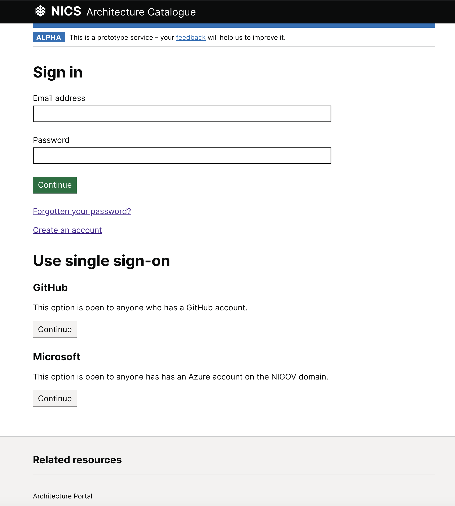
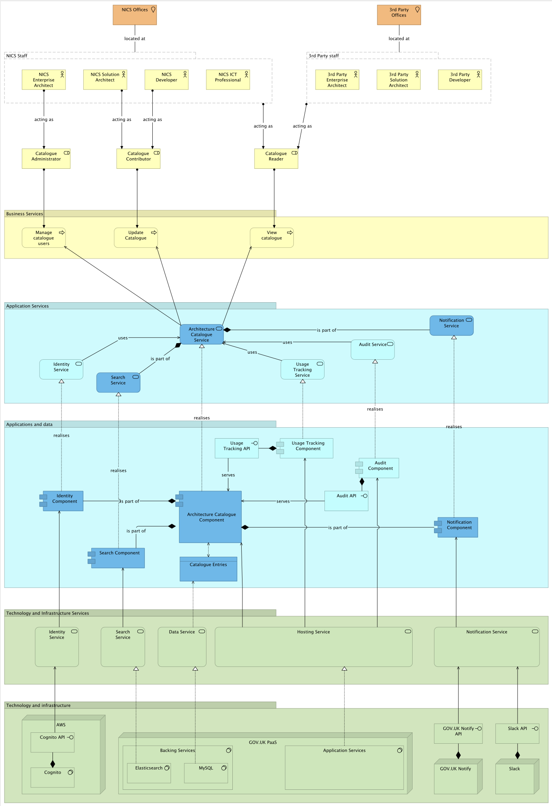

# NICS Architecture Catalogue [](https://circleci.com/gh/dof-dss/architecture-catalogue)



## Application architecture



## Installation

### Pre-requisites (Mac)

#### Install [Homebrew](https://brew.sh/)

#### Install php

```
brew install php
```

#### Install mysql

```
brew install mysql
```

#### Install eleasticsearch

```
brew tap elastic/tap
brew install elastic/tap/elasticsearch-full
```

#### Install Laravel Installer

```
composer global require laravel/installer
```

Make sure to place Composer's system-wide vendor bin directory in your $PATH so the laravel executable can be located by your system.

macOS and GNU / Linux Distributions: $HOME/.composer/vendor/bin

#### Install Valet

```
composer global require laravel/valet
valet install
```

### Install project

```
git clone https://github.com/dof-dss/architecture-catalogue.git
composer install
npm install
```

### Create env file

```
cp .env.example .env
```

### Generate application key

```
php artisan key:generate
```

## Deployment

### Local build

```
npm run dev
```

### Register the directory with Valet

Change into the architecture-catalogue directory.

```
valet link catalogue
```

#### Enable local HTTPS

```
valet secure catalogue
```

#### Local browser

https://catalogue.test

## Testing

You can run a full suite of tests using phpunit

```
./vendor/bin/phpunit
```

## Roadmap

[Architecture Catalogue Roadmap](https://github.com/dof-dss/catalogue-roadmap/projects/1)
